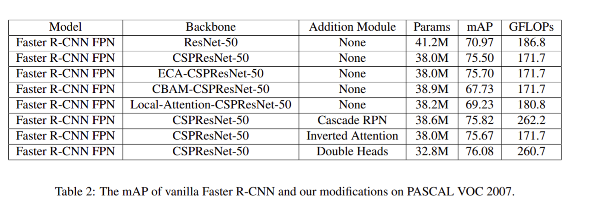
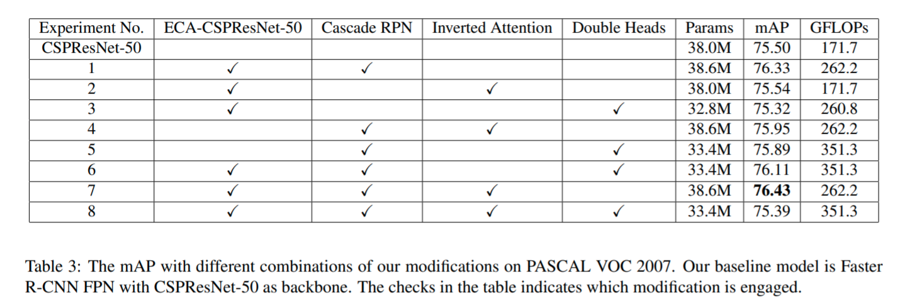

# Pytorch--mask-rcnn
We modify the original Mask/Faster R-CNN which is implemented in torchvision with 4 aspects: backbone, region proposal network, RoI head and inverted attention (IA) module.<br>
The modification are either modification or re-implementation of the papers below.

## Backbone
[CSPNET: A New Backbone That can enhance learning capability of CNN](https://arxiv.org/pdf/1911.11929.pdf)<br>
[CBAM: Convolutional Block Attention Module](https://openaccess.thecvf.com/content_ECCV_2018/papers/Sanghyun_Woo_Convolutional_Block_Attention_ECCV_2018_paper.pdf)<br>
[ECA-Net: Efficient Channel Attention for Deep Convolutional Neural Networks](https://arxiv.org/pdf/1910.03151.pdf)

## RPN
[Cascade RPN: Delving into High-Quality Region Proposal Network with Adaptive Convolution](https://arxiv.org/pdf/1909.06720.pdf)

## RoI Head
[Rethinking Classification and Localization for Object Detection](https://arxiv.org/pdf/1904.06493.pdf)

## Inverted Attention
[Improving Object Detection with Inverted Attention](https://arxiv.org/pdf/1903.12255.pdf)

## Result



# Installation
you can intall the requirements by anaconda or pip
* python=3.7.7
```
pytorch=1.6.0=py3.7_cuda10.1.243_cudnn7.6.3_0
torchvision=0.7.0=py37_cu101
numpy=1.19.1=py37hbc911f0_0
```
## conda environment setting
```Shell
conda env create -f environment.yml -n rcnn
```
## start conda environment
```Shell
conda activate rcnn
```
# Data Preparation
you can use the .sh file to collect the data you want
```
./download_coco2017.sh
./download_PASCAL.sh
./download_pedestrain.sh
```
## Run the pedestrian dataset to make sure your model works
```
./download_pedestrian.sh
python test_pedestrian.py
```
## Training on PASCAL
When you want to train on pascal voc.
you don't need to run the .sh file because it is a built-in function in voc_utils.
```
python train_voc.py
```
## Training COCO in distribute system
## run distribute
```Shell
python -m torch.distributed.launch --nproc_per_node=4 --use_env train_coco.py

python -m torch.distributed.launch --nproc_per_node= --use_env train_coco\
    --dataset coco --model maskrcnn_resnet50_fpn --epochs 26\
    --lr-steps 16 22 --aspect-ratio-group-factor 3

python -m torch.distributed.launch --nproc_per_node=4 --use_env train_coco\
    --dataset coco --model maskrcnn_resnet50_fpn --epochs 26\
    --lr-steps 16 22 --aspect-ratio-group-factor 3

CUDA_VISIBLE_DEVICES=0,1 python -m torch.distributed.launch --nproc_per_node=2 --use_env train_voc.py

```
## Kill the nvidia zombie threads
```Shell
kill $(ps aux | grep train_coco.py | grep -v grep | awk '{print $2}') 
```

## Problem shooting
1. cannot run .sh file 
```
chmod 777 YOUR_SH_FILE_NAME.sh
```

# Citation
The backbone foler ```timm``` and the pretrain model are from the awesome github repo [rwightman/pytorch-image-models](https://github.com/rwightman/pytorch-image-models) 
 

